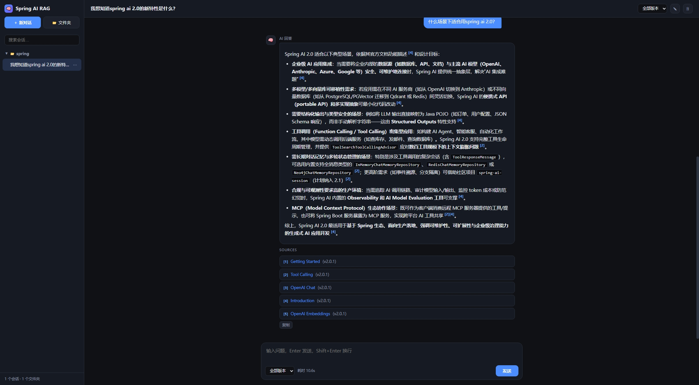

# spring-ai-docs-rag

[](LICENSE)
[](https://adoptium.net/)
[](https://spring.io/projects/spring-ai)
[](https://github.com/GenOrch/spring-ai-docs-rag/actions/workflows/ci.yml)

[English](README.md) · **简体中文**

> 一个从零实现的 RAG（检索增强生成）项目，基于 **Spring AI 2.0** + **Spring Boot 4.1 / JDK 21**。它摄取**版本化的 Spring AI 文档**（docs.spring.io 背后的 AsciiDoc 源码），用「混合检索 + 重排 + 带引用生成」回答提问；中文提问会先译成英文再检索。

```
AsciiDoc (v2.0.1 / v1.1.8) → 切分 → 向量化 (DashScope)
  → 混合检索 (向量 + BM25 + RRF) → 重排 (gte-rerank-v2)
  → 生成 (Qwen，带引用) → SSE 流式 + sources
```

基于 Spring AI 的模块化 RAG 抽象（`DocumentReader`、`QueryTransformer`、`DocumentRetriever`、`DocumentPostProcessor`）和 `VectorStore` 接口构建。

## 功能特性

- **版本化语料**：按版本摄取 Spring AI 文档（`v2.0.1` + `v1.1.8`），`/ask` 可带 `version` 过滤回答。
- **混合检索**：稠密向量检索 + 内嵌 Lucene BM25，用 RRF 融合。
- **查询翻译**：中文提问先译成英文再检索（回答仍跟随提问语言）。
- **重排**：DashScope `gte-rerank-v2`，通过自定义 `DocumentPostProcessor` 直连原生接口。
- **带引用答案**：LLM 内联 `[n]` 引用，`/ask` 末尾推送 `sources` SSE 事件（真实 URL 列表，每条来源标注 Spring AI 版本）。
- **多轮对话 + 会话持久化**：`/ask` 可带 `conversationId` 回顾上文；会话、消息、文件夹持久化在本地 SQLite（`data/conversations.db`），重启不丢。
- **持久化**：向量与 chunk 文本持久化在 pgvector（RDS）——重启复用（0 次重向量化）；BM25 索引由向量表重建。
- **向量库**：**PostgreSQL + pgvector**（共享、持久，数据在 RDS）。
- **评估**：`GET /admin/eval` 输出检索命中率、重排命中率、来源命中率。
- **Demo 页**：`/` 提供类 ChatGPT 的聊天 UI——会话列表 + 文件夹、多轮问答、markdown、引用与来源版本标注。
- **可观测**：Prometheus 指标（`gen_ai.*` + 自定义 `rag.*`）暴露在 `/actuator/prometheus`，OTel 追踪到 Jaeger——搭建步骤见 [可观测](observability/README.md)。
- **MCP Server**：在 `/mcp` 暴露一个 MCP Server，四个工具（`rag_ask` / `rag_eval` / `rag_status` / `rag_logs`）供 AI Agent 查询和驱动服务。

## 环境要求

- JDK 21、Maven 3.9+、Git 2.25+
- 一个 DashScope（阿里云）API key
- **PostgreSQL + pgvector**（RDS）——向量库

完整配置参考（每个环境变量、下载地址、密钥配置）：[配置](docs/configuration.md)。

## 运行（5 分钟跑通）

```bash
# 1. 克隆语料源码（一次性；data/raw/spring-ai/ 下每个目录 = 一个版本）
git clone --depth 1 --filter=blob:none --sparse --branch v2.0.1 \
    https://github.com/spring-projects/spring-ai.git data/raw/spring-ai/2.0.1
git -C data/raw/spring-ai/2.0.1 sparse-checkout set spring-ai-docs
git clone --depth 1 --filter=blob:none --sparse --branch v1.1.8 \
    https://github.com/spring-projects/spring-ai.git data/raw/spring-ai/1.1.8
git -C data/raw/spring-ai/1.1.8 sparse-checkout set spring-ai-docs

# 2. 设置 key + 数据库（macOS/Linux 用 export；Windows cmd 用 set）
export DASHSCOPE_API_KEY=sk-...
export RAG_INGEST_ON_STARTUP=true   # 首次启动自动灌库
export PGVECTOR_URL=jdbc:postgresql://<host>:5432/rag   # 向量库是 pgvector（RDS）
export PGVECTOR_USER=<user>
export PGVECTOR_PASSWORD=<password>

# 3. 启动（demo 页在 http://localhost:8080）
mvn spring-boot:run                                        # PostgreSQL + pgvector (RDS)
```

**怎么判断跑通了**（每步都可验证）：

1. 启动日志出现「索引就绪」——`startup index ready: 1426 chunks available`。
2. 打一次问答——逐 token 流式输出，末尾推一个 `sources` 事件（带引用 URL）：
   ```bash
   curl -N -X POST http://localhost:8080/ask -H "Content-Type: application/json" \
     -d '{"question":"How does ChatClient work?","version":"2.0.1","conversationId":"demo-1"}'
   ```
3. 评估——检索 / 重排 / 来源命中率：
   ```bash
   curl -s http://localhost:8080/admin/eval
   ```
4. 打开 <http://localhost:8080> 看聊天 UI——会话列表 + 文件夹、多轮追问、markdown 渲染、可点击的 `[n]` 引用、来源版本标注：

   

若没设 `RAG_INGEST_ON_STARTUP`，先手动灌库：`curl -X POST http://localhost:8080/admin/ingest`。

**冒烟测试**——从空向量表把整条链路跑一遍（与上面「启动自动灌库」是两种场景）：先 `TRUNCATE TABLE vector_store`，再手动灌库：

```bash
curl -X POST http://localhost:8080/admin/ingest   # 全量灌库：249 页 -> 1426 chunks（约 90 秒）
curl -X POST http://localhost:8080/admin/ingest   # 增量：1426/1426 已索引、0 新增（约 3 秒）
curl -N -X POST http://localhost:8080/ask -H "Content-Type: application/json" \
  -d '{"question":"spring ai 2.0有哪些特色"}'           # 带引用回答 + sources
curl -s http://localhost:8080/admin/eval              # 命中率（约 1.0 / 0.9 / 1.0）
```

[文档索引](docs/README.md) · [代码阅读](docs/code-tour.md) · [配置](docs/configuration.md)。

## MCP

App 同时暴露一个 **MCP Server**（Model Context Protocol）在 `/mcp`（streamable HTTP），让 AI Agent 既能查、又能驱动这个服务，共四个工具：

- `rag_ask` —— 对知识库提问（带引用 + 来源）
- `rag_eval` —— 跑检索/重排评估
- `rag_status` —— 索引状态（chunk 数、语料版本）
- `rag_logs` —— 最近请求审计 + 链路方法日志

两个 AOP 切面（`observability/audit/RequestAuditAspect`、`observability/audit/OperationLogAspect`）把每次请求和每个链路方法调用记入内存环形缓冲，用 OTel traceId 关联。

`/mcp` 端点与 `/admin/*` 一样受 `AdminAuthFilter` 保护：loopback 始终放行，远程调用需带 `X-Admin-Token`。

## 架构



完整设计（中文）：[架构](docs/architecture.md) · [代码阅读](docs/code-tour.md) · [文档索引](docs/README.md)。

## 参与贡献

见 [贡献](CONTRIBUTING.md)。

## 许可证

[Apache License 2.0](LICENSE)。
