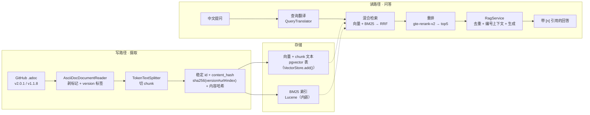

# spring-ai-docs-rag · 架构设计

> **读者**：想懂「为什么这么设计」的人（贡献者 / 想深入设计的人）。
> **解决什么**：讲清写/读两条路径、两处落库（向量+chunk 文本同存 pgvector 表、BM25 内存索引），以及接口化的「缝」。
> **相关文档**：[文档索引](README.md) · [代码阅读](code-tour.md) · [配置](configuration.md) · [可观测](../observability/README.md)

基于 **Spring AI 2.0** 的 RAG（检索增强生成）全链路项目：以 Spring AI 官方文档为语料，实现「版本化摄取 → 混合检索 → 重排 → 带引用生成」，中文提问也能命中英文文档。

## 1. 定位

对 **Spring AI 官方文档**（按版本区分，`v2.0.1` + `v1.1.8`）做「混合检索 + 重排 + 带引用生成」的问答系统。数据源是本地 AsciiDoc 多版本语料，向量库存 PostgreSQL + pgvector（RDS）。

技术栈：**Spring Boot 4.1.1 + Spring AI 2.0.1 + JDK 21**；模型 DashScope（LLM `qwen-plus`、embedding `text-embedding-v3` 1024 维、rerank `gte-rerank-v2`）。

## 2. 架构总览



> 渲染导出：`docs/architecture.svg`（矢量）+ `docs/architecture.png`（位图）。重新生成见 [mermaid.ink](https://mermaid.ink)。

### 2.1 写路径（摄取）

```
GitHub spring-projects/spring-ai（tag v2.0.1 / v1.1.8）
  → git clone → data/raw/spring-ai/{version}/（本地 .adoc 快照，目录 = 版本）
  → DocumentReader：AsciiDocDocumentReader 读本地 .adoc（多版本，打 version 标签）
  → TokenTextSplitter 切 chunk
  → withStableIds：id = sha256(version#sourceUrl#index) + content_hash   [幂等，跨版本不冲突，内容变更可检测]
  → 分批 vectorStore.add()（内部用 text-embedding-v3 向量化，≤10/批）
  → 同一份 chunk 落到两处：
       · 向量 + chunk 文本 → pgvector 表（重启 0 次重 embed）
       · BM25 倒排 → LuceneKeywordIndex（内存，重启由 chunk 文本重建）
```

### 2.2 读路径（问答）

```
POST /ask {question, version?}
  → QueryTranslator（包装 TranslationQueryTransformer）：中文提问译成英文
  → 混合检索：向量 top20 + BM25 top20 → RRF 融合 → top20
  → version 过滤下推（可选，向量 filterExpression + BM25 version 字段）
  → 重排：gte-rerank-v2 → top5
  → 按 URL 去重（引用 [n] 与来源列表 1:1 对齐）
  → RagService：拼编号上下文 [n] 标题 — URL + 正文 → ChatClient 流式生成
  → SSE 逐 token + [n] 引用 + sources（URL 列表）
```

### 2.3 重启恢复

```
corpusStore.exists()?
  是 → readAll（从 pgvector 表读回 chunk）→ 重建 BM25（0 次 embed）
  否 → 走写路径摄取
```

## 3. 核心设计

### 3.1 版本化语料（目录 = 版本）

数据源是 Spring AI 文档的 **AsciiDoc 源码**（GitHub `spring-projects/spring-ai`，与 docs.spring.io 同源，Apache 2.0），而非抓取渲染后的 HTML：

- `git clone --branch v2.0.1` / `v1.1.8` 落到 `data/raw/spring-ai/{version}/`。
- `AsciiDocDocumentReader` 遍历该目录，**每个子目录 = 一个版本**，自动给 chunk 打 `version` 标签。
- 好处：与官网同源、`git clone` 不封 ip、版本化零歧义、许可清晰可再分发。

当前语料：`v2.0.1`（121 页）+ `v1.1.8`（128 页）= **249 页 → 1426 chunks**。

### 3.2 混合检索 + RRF

两条互补的召回腿，用 RRF 融合成单一排序：

- **向量腿**：`VectorStore.similaritySearch`，管「语义相似」（口语化 / 同义改写）。
- **词法腿**：Lucene BM25（`EnglishAnalyzer` + `BooleanQuery` of `TermQuery`），管「词法精确」（专有名词 / API 名）。
- **RRF**：`score(d) = Σ 1/(k + rank_i(d))`，k=60。向量相似度（0~1）与 BM25 分数（无上界）**量纲不同、不可直接加权**，用排名融合最稳。

### 3.3 稳定 id（幂等 + 变更检测）

chunk id = `sha256(version#sourceUrl#chunkIndex)`，另在 metadata 打一个 `content_hash`（chunk 文本的 SHA-256）：

- **重灌幂等**：upsert 按 id 命中，重复灌库不累积。
- **跨版本不冲突**：同一页在不同版本下 id 不同（version 前缀）。
- **内容变更可检测**：id 不变但文本变了时，`content_hash` 不一致 → 重新 embed 该块（避免"位置寻址"导致的旧内容残留）。

### 3.4 检前查询翻译

中文提问先经 `QueryTranslator`（包装 Spring AI 的 `TranslationQueryTransformer`）译成英文再检索：

- 核心收益是**救活 BM25 词法腿**——`EnglishAnalyzer` 无法分词中文，译英后词法命中才生效；向量腿本就跨语言。
- **语言检测**：提问无 CJK 字符（已是英文）时**跳过翻译**，省一次 LLM 调用。
- 生成仍用原始中文提问，回答跟随用户语言；翻译失败时回退原文，不阻断问答。

### 3.4.1 增量摄取

稳定 id + `content_hash` 使**增量摄取**成为可能：`ingest()` 先读回已存在 id 及其 content_hash，只 embed **新增**的 chunk 或**内容已变更**的 chunk。重复灌同一语料实测「1426 of 1426 already indexed, embedding only 0 new」，**约 3 秒**完成（全量重 embed 约 90 秒）。

### 3.5 重排（自研 `DocumentPostProcessor`）

`DashScopeRerankPostProcessor implements DocumentPostProcessor`，直连 DashScope `gte-rerank-v2` 原生接口（不走 OpenAI 兼容端点），对融合候选 20 条精排取 top5。

### 3.6 存储（pgvector，单一后端）

- **`VectorStore`**：`PgVectorStore`（向量与 chunk 文本都在 `vector_store` 表，多实例共享、重启 0 次重 embed）。
- **`CorpusStore`**：`JdbcCorpusStore`（原生 JDBC，SQL 读回 chunk 以重建 BM25 与做增量摄取）。
- 检索代码依赖 Spring AI 的 `VectorStore` 接口，未来换 Milvus 等后端零代码改动。

## 4. 项目结构

### 4.1 目录

```
spring-ai-docs-rag/
├─ pom.xml
├─ .env.example / .gitignore
├─ README.md / README.zh-CN.md
├─ docs/           README(文档索引) + architecture.md + code-tour.md + configuration.md + .svg/.png
├─ observability/  README + prometheus.yml + grafana 数据源/大盘 + docker-compose.yml
├─ src/main/java/com/genorch/rag/
│  ├─ SpringAiRagApplication.java
│  ├─ config/        RagProperties + RagConfig + ApiKeyStartupCheck
│  ├─ document/      DocumentMeta（元数据 key 常量：source_url/title/version/content_hash/...）
│  ├─ ingest/        AsciiDocDocumentReader + IngestionService + StartupIngestionRunner
│  │  └─ store/      CorpusStore(接口) + JdbcCorpusStore
│  ├─ retrieve/      LuceneKeywordIndex + HybridDocumentRetriever + RrfFusion
│  ├─ rerank/        DashScopeRerankPostProcessor
│  ├─ service/       RagService + QueryTranslator（读路径编排）
│  ├─ eval/          EvalService + GoldenQa + EvalReport
│  ├─ mcp/           RagMcpTools（4 个 @McpTool）
│  ├─ observability/ RagMetrics + TraceIds + TraceIdFilter
│  │  └─ audit/      AuditStore + RequestAuditAspect + OperationLogAspect + ...
│  └─ web/           AskController + AdminController + AskRequest + AdminAuthFilter
├─ src/main/resources/
│  ├─ application.yml
│  └─ static/index.html + eval/golden-qa.json
└─ src/test/java/com/genorch/rag/
   ├─ retrieve/RrfFusionTest + LuceneKeywordIndexTest + HybridDocumentRetrieverTest
   ├─ ingest/IngestionServiceTest + AsciiDocDocumentReaderTest
   ├─ observability/audit/AuditStoreTest
   ├─ rerank/DashScopeRerankPostProcessorTest
   └─ service/RagServiceTest + QueryTranslatorTest
```

> 包名 `com.genorch.rag`，groupId `com.genorch`。每个包的职责与依赖方向见各包 `package-info.java`；两条链路逐步落到类/方法见 [代码阅读](code-tour.md)。

### 4.2 依赖（Maven，实测坐标）

- `spring-boot-starter-parent` **4.1.1**
- `spring-ai-bom` **2.0.1**（dependencyManagement import）
- `spring-boot-starter-web`（Web / REST / SSE）
- `spring-boot-starter-aspectj`（AOP 请求审计 + 链路操作日志切面）
- `spring-ai-starter-model-openai`（OpenAI 兼容端点 → 指向 DashScope，chat + embedding）
- `spring-ai-rag`（`DocumentRetriever` / `DocumentPostProcessor` / `QueryTransformer`）
- `spring-ai-commons`（`Document` / `TokenTextSplitter` / `DocumentReader`）
- `spring-ai-vector-store`（`VectorStore` / `SearchRequest` 抽象）
- `spring-ai-starter-mcp-server-webmvc`（MCP server，WebMVC transport）
- `org.apache.lucene:lucene-core` + `lucene-analysis-common` 9.12.1（内嵌 BM25）
- `spring-boot-starter-actuator` + `micrometer-registry-prometheus` + `spring-boot-starter-opentelemetry`（可观测）
- `spring-ai-starter-vector-store-pgvector`（pgvector 向量库）

## 5. 运行方式

克隆语料、设置 key、启动见 [根 README「Run」](../README.md#run-5-minutes)（clone 目录 = 版本）。

端点：

- `GET /`（demo 页，流式对话 UI）
- `POST /ask`（SSE 问答，body 可带 `version` 过滤）
- `POST /admin/ingest`（灌库）
- `GET /admin/eval`（评估）
- `/mcp`（MCP server，streamable HTTP，受 `AdminAuthFilter` 保护）
- `/actuator/prometheus`（Prometheus 指标）

## 6. 可观测与评估

### 6.1 指标（Prometheus `/actuator/prometheus`）

- 框架自动 `gen_ai.*`：`gen_ai_client_operation_seconds`（chat/embedding 耗时）、`gen_ai_client_token_usage_total`（token 用量）。
- 自定义 `rag.*`：`rag_retrieve_seconds`、`rag_retrieve_vector_hits_total` / `rag_retrieve_keyword_hits_total`、`rag_retrieve_vector_errors_total` / `rag_retrieve_keyword_errors_total`（两腿静默降级计数）、`rag_rerank_seconds`、`rag_eval_hit_rate` 等。

### 6.2 追踪（OTel → Jaeger）

`spring-boot-starter-opentelemetry` 走 OTLP 到 Jaeger（4318），span 树：

```
POST /ask → rag.retrieve → embedding(gen_ai.*)
         → rag.rerank   → http post(dashscope rerank)
         → chat qwen-plus(gen_ai.usage.*)
```

> 接收端服务（Jaeger / Prometheus / Grafana）的下载地址、配置文件（`prometheus.yml`、Grafana 数据源、大盘 JSON）与一步一步启动步骤见 [可观测](../observability/README.md)。

### 6.3 评估（`GET /admin/eval`）

基于 `eval/golden-qa.json`（`question` + `mustContain` 命中词 + `sourceContains` 来源片段）：

- `hitRate`：检索召回（RRF 融合后 top20）。
- `rerankHitRate`：重排后 top5 命中（进入 LLM 上下文的精度）。
- `sourceHitRate`：来源命中（引用指向正确的页）。
