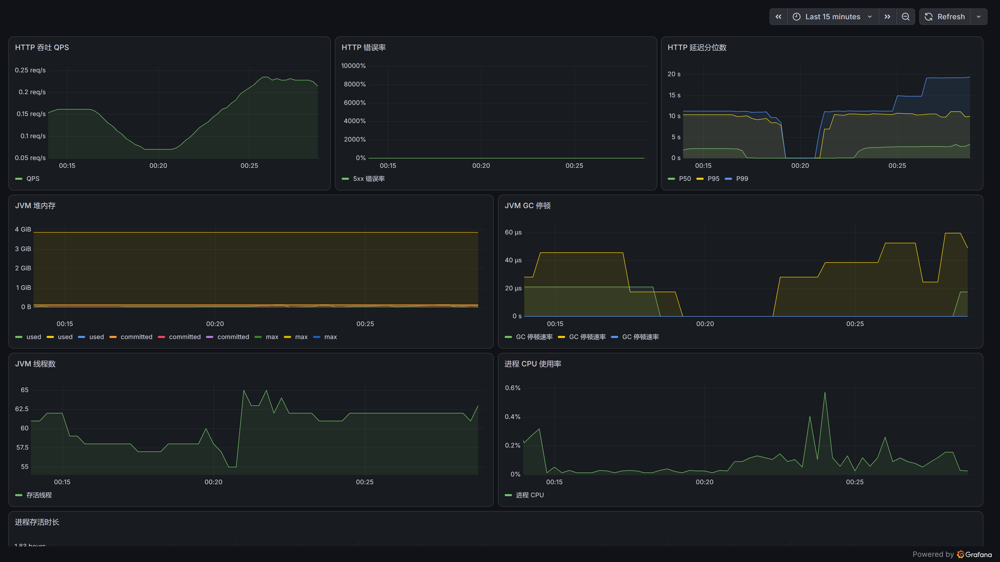
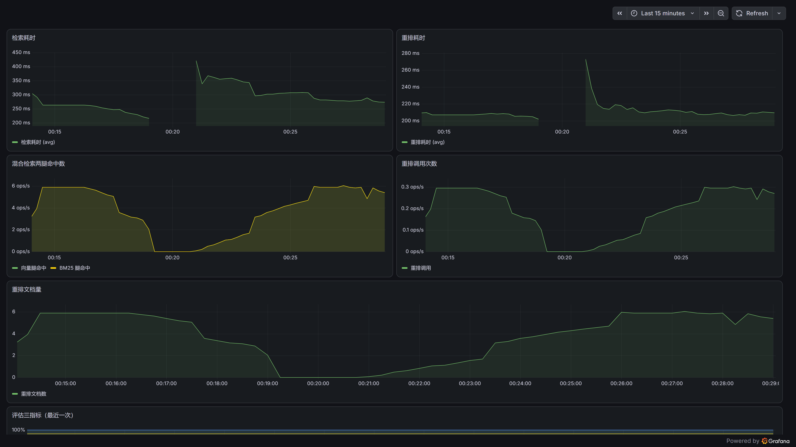
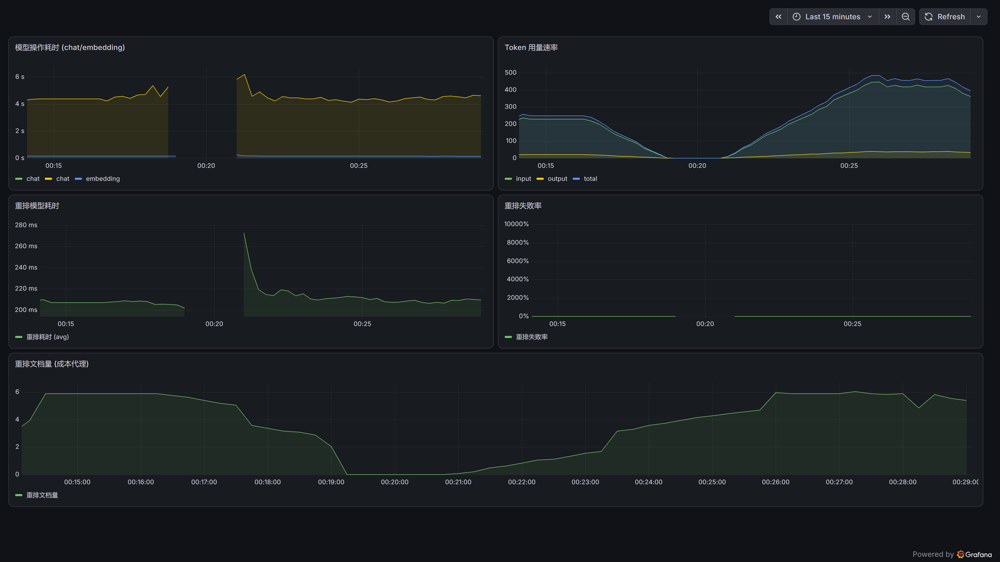
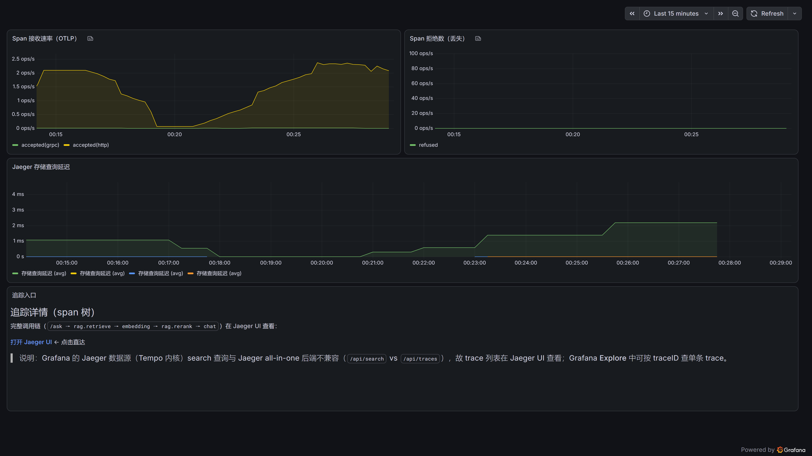
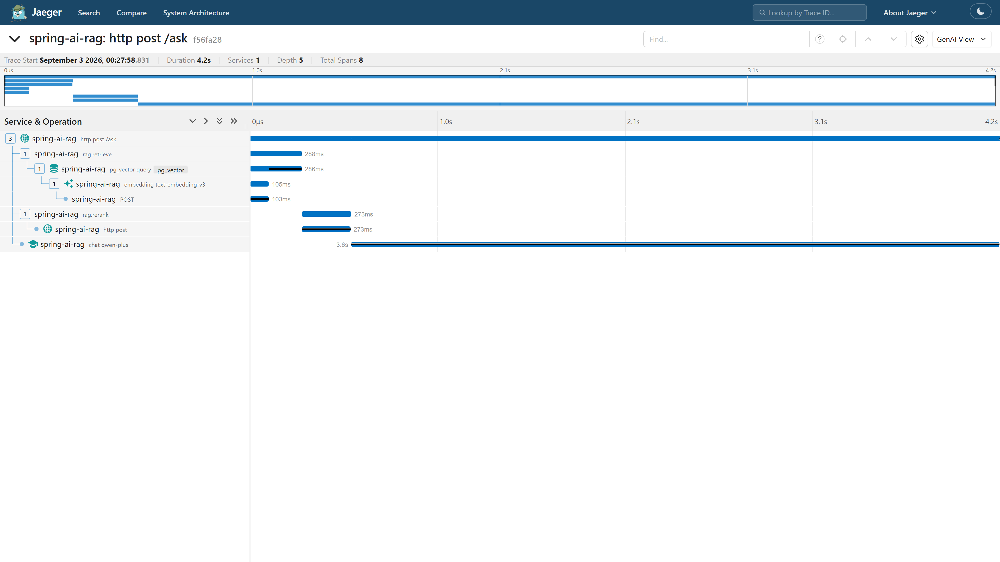

# 可观测 · 配置指南

> **读者**：要接监控、看大盘的人。
> **解决什么**：把 Jaeger（追踪）/ Prometheus（指标）/ Grafana（大盘）一步步配好并验证。本目录自带全部配置文件。
> **相关文档**：[根 README](../README.md) · [文档索引](../docs/README.md) · [架构](../docs/architecture.md) · [配置](../docs/configuration.md)

本项目开箱提供两层可观测：**指标（Prometheus 格式）** 与 **追踪（OTel → Jaeger）**，接收端与 app 解耦、可替换。

```
RAG app (8080)
  ├─ 指标  → GET /actuator/prometheus → Prometheus (:9090) → Grafana (:3000)
  └─ span  → OTLP :4318               → Jaeger (:16686)
```

## 0. 本目录文件清单

| 文件 | 作用 |
|---|---|
| `prometheus.yml` | Prometheus 抓取配置（抓 app 的 `/actuator/prometheus`） |
| `docker-compose.yml` | Docker 一键起 Jaeger + Prometheus + Grafana（可选） |
| `grafana/datasource.yaml` | Grafana 数据源（Prometheus + Jaeger） |
| `grafana/dashboard-provider.yaml` | 把 4 个大盘自动加载到 `spring-ai-docs-rag` folder |
| `grafana/dashboards/*.json` | 4 个大盘（见下） |

## 1. 监控大盘结构（1 folder + 4 大盘，各司其职）

监控分两类，对应不同大盘、不同关注点：

| 大盘 | 分类 | 回答的问题 | 关键指标 |
|---|---|---|---|
| **服务运行状态** `spring-ai-docs-rag-service` | 服务本质监控 | 服务作为「服务」还健康吗 | HTTP QPS/错误率/延迟、JVM 堆/GC/线程、CPU、uptime |
| **检索链路** `spring-ai-docs-rag-pipeline` | 业务指标 | RAG 链路干得好吗 | 检索/重排耗时、两腿命中、重排调用/文档数、评估三指标 |
| **模型调用与成本** `spring-ai-docs-rag-model` | 模型指标 | 模型烧钱/变慢/出错了吗 | chat·embedding·rerank 延迟、token、重排失败率、成本估算 |
| **追踪** `spring-ai-docs-rag-traces` | 追踪 | 一次请求的调用链长什么样 | Jaeger UI 入口（trace 列表在 Jaeger UI；Grafana Explore 可按 traceID 查单条） |

> **为什么拆**：值班看「服务运行状态」（内存/GC/HTTP），调 RAG 看「检索链路」，控成本看「模型调用」，排链路看「追踪」——混在一个大盘里，各拨人都找不到自己要的。

## 1.1 大盘截图（`../docs/screenshots/`）

| 截图 | 内容 |
|---|---|
|  | HTTP QPS/错误率/延迟分位数、JVM 堆/GC/线程/CPU |
|  | 检索/重排耗时、两腿命中、评估三指标 |
|  | 模型耗时、token、重排失败率、成本估算 |
|  | 追踪大盘（Jaeger UI 入口） |
|  | 单次请求的 span 树（waterfall） |

## 2. 前提

- 已按根目录 README「运行」把 RAG app 起起来（监听 8080）。
- 接收端二选一：**方式 A（原生二进制，无需 Docker）** 或 **方式 B（Docker）**。

## 3. 方式 A：原生二进制（Windows / Linux / macOS 通用）

### 3.1 Jaeger（追踪）

1. 下载 all-in-one 二进制：<https://www.jaegertracing.io/download/>
2. 解压后启动：
   ```bash
   ./jaeger        # UI http://localhost:16686 ；OTLP gRPC :4317 / HTTP :4318
   ```

### 3.2 Prometheus（指标）

1. 下载：<https://prometheus.io/download/>
2. 用本目录的 `prometheus.yml` 启动：
   ```bash
   ./prometheus --config.file=prometheus.yml   # UI http://localhost:9090
   ```

### 3.3 Grafana（大盘）

1. 下载：<https://grafana.com/grafana/download>
2. 启动：`./bin/grafana-server` → <http://localhost:3000>（默认 admin/admin）
3. 配数据源：Grafana UI → Connections → Data sources → Add → **Prometheus** → URL `http://localhost:9090` → Save & test。
4. 导入大盘（一次性）：Dashboards → New → Import → 依次上传 `grafana/dashboards/` 下的 4 个 JSON（或把它们 + `dashboard-provider.yaml` + `datasource.yaml` 放进 `conf/provisioning/` 让 Grafana 自动加载到 `spring-ai-docs-rag` folder）。

## 4. 方式 B：Docker 一键

```bash
docker compose -f observability/docker-compose.yml up -d
```

数据源 + 4 个大盘由 provisioning **自动加载**，无需手动导入。打开 <http://localhost:3000> → Dashboards → `spring-ai-docs-rag` folder 即可看到 4 个大盘。

> 注意：Docker 方式下，Prometheus 容器里的 `localhost:8080` 指向容器自身、访问不到宿主机上的 app。要让 Prometheus 抓到宿主机 app，需把 `prometheus.yml` 的 targets 改成 `host.docker.internal:8080`（Docker Desktop）或改用 host 网络模式（详见 `prometheus.yml` 顶部注释）。

## 5. 端到端验证

1. 打一次问答（触发检索/重排/模型调用 + 审计）：
   ```bash
   curl -N -X POST http://localhost:8080/ask -H "Content-Type: application/json" \
     -d '{"question":"How does ChatClient work?","version":"2.0.1"}'
   ```
2. **Jaeger**（:16686）搜 service `spring-ai-docs-rag` → span 树：
   `http post /ask → rag.retrieve → embedding → rag.rerank → chat qwen-plus`
3. **Prometheus**（:9090）搜 `rag_retrieve_seconds_count`、`rag_rerank_calls_total`、`gen_ai_client_token_usage_total` → 有数据。
4. **Grafana**（:3000）打开 `spring-ai-docs-rag` folder 的 4 个大盘 → 面板出曲线。

## 6. 常见问题

- **追踪有、指标无** → 检查 Prometheus `targets`（:9090/targets）里 `spring-ai-docs-rag` 是否 `UP`；确认 `prometheus.yml` 的 targets 是 `localhost:8080`。
- **指标有、大盘无数据** → 确认 Grafana 的 Prometheus 数据源 URL 是 `http://localhost:9090`，且大盘时间范围（右上角）覆盖了打 `/ask` 的时间。
- **span 到不了 Jaeger** → 确认 `management.opentelemetry.tracing.export.otlp.endpoint` 指向 `http://localhost:4318/v1/traces`（可用 `OTLP_TRACING_ENDPOINT` 覆盖）；确认 Jaeger 4318 端口在监听。
- **`rag_rerank_*` 无数据** → 这些指标在重排真正发生后才产生，先打一次 `/ask`。

## 7. 后端可替换

后端只负责「接收」指标/span，与 app 解耦——Jaeger 可换 Tempo/SkyWalking，Prometheus 可换 VictoriaMetrics，Grafana 可换其它看板，均不影响 app 代码。
